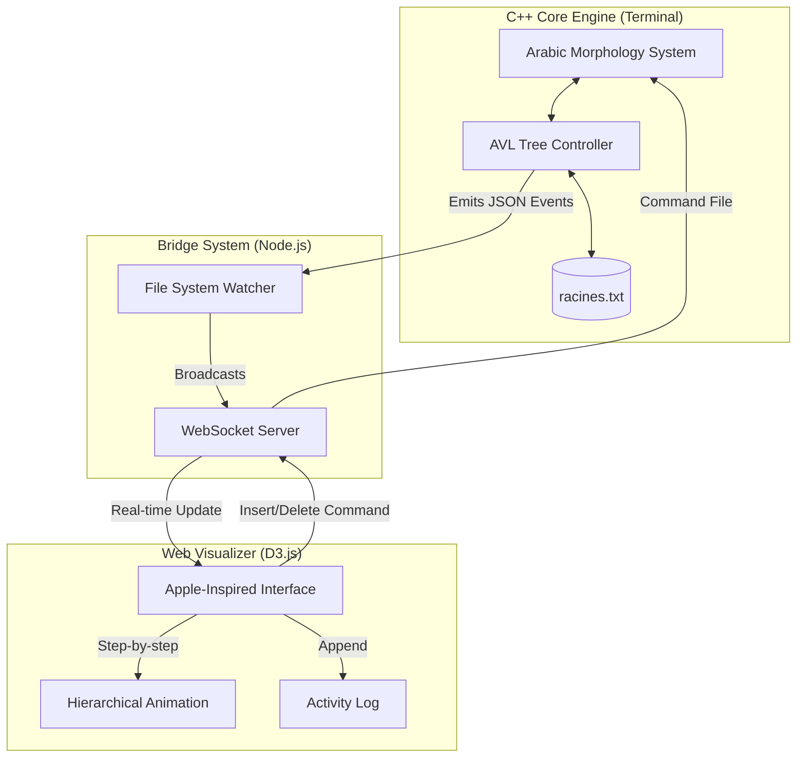

# Arabic Morphology Engine & Real-Time AVL Visualizer


A high-performance Arabic morphological analysis system built on a self-balancing **AVL Tree** architecture. This project features a state-of-the-art **Real-Time Web Visualizer** that provides a synchronized, animated view of the data structure's internal state as operations occur.

---

## System Architecture

The following diagram illustrates the bi-directional synchronization between the high-performance C++ engine and the modern web-based visualizer.



---

## Key Features

### Morphological Engine

- **Root Extraction**: Intelligent detection of triliteral roots from complex Arabic words.
- **Family Generation**: Automatic derivation of words using standard Arabic schemes (_Wazn_).
- **Corpus Analysis**: Paginated analysis of large text files in Strict or Discovery modes.
- **Multi-language Support**: Full UI support for **Arabic**, **English**, and **French**.

### Real-Time Visualizer

- **Smooth Animations**: Powered by **D3.js** with sequential step-by-step tree balancing.
- **Apple-Style Aesthetics**: Premium dark glassmorphism UI with micro-animations.
- **Complexity Tracking**: Live Big-O analysis (Time: $O(\log n)$, Space: $O(n)$) updated per operation.
- **Interactive Controls**: Manage the tree directly from the browser with instant terminal sync.

---

## Getting Started

### Prerequisites

- **Compiler**: `g++` (supporting C++17)
- **Environment**: Linux/Unix
- **Runtime**: `Node.js` (v18+) for the visualizer

### 1. Build the System

```bash
# Clone the repository
git clone https://github.com/AhmedCha/Arabic-Morphology-Engine.git
cd Arabic-Morphology-Engine

# Build standard version
make all

# Build version with Visualizer support
make visualizer
```

### 2. Launch the Visualizer

```bash
# Install web dependencies
make install-vis

# Start the bridge server
make start-server
```

Visit **[http://localhost:3000](http://localhost:3000)** in your browser.

### 3. Run the Engine

```bash
./morphology-engine-vis
```

---

## Project Structure

```text
.
├── src/                    # C++ Source Code
│   ├── AVLTree.h           # Instrumented AVL implementation
│   ├── morphologyEngine.h  # Morphological logic
│   ├── main.cpp            # Entry point
│   └── ...
├── visualizer/             # Web Visualizer
│   ├── server.js           # Node.js WebSocket Bridge
│   └── public/             # D3.js Frontend (HTML/CSS/JS)
├── Makefile                # Unified build system
├── racines.txt             # Data persistence (Roots)
└── schemes.txt             # Arabic patterns definition
```

---

## Tech Stack

- **Backend**: C++17 (Performance & Data Structures)
- **Bridge**: Node.js & WebSockets (Real-time I/O)
- **Frontend**: Vanilla JavaScript & D3.js (Visualization)
- **Styling**: Modern CSS (Glassmorphism & SF Pro / Inter fonts)

---

_Developed for advanced Arabic linguistic processing and data structure education._
